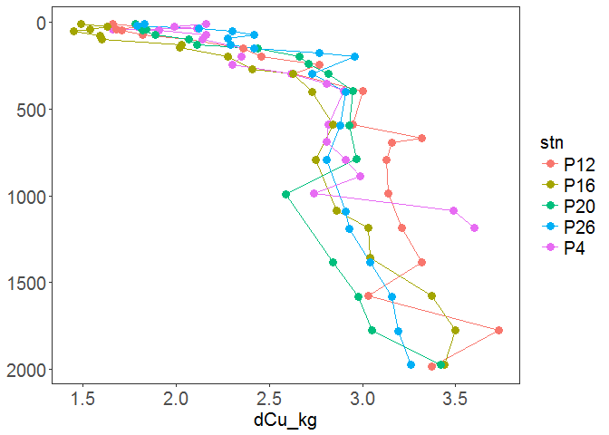
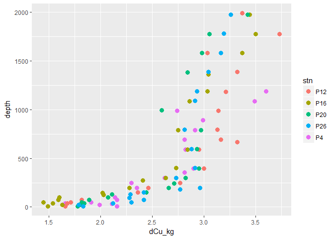

Ocgrtools
================
Anna Posacka
December 6, 2016

**Ocgrtools** lets you to create speady plots of ocean property depth profiles and contains a dataset to go with it. This dataset is part of the study that was focused on investigating the **biogeochemical cycling of copper in the subarctic NE Pacific**, more information on the data and the study can be found [in this public repo](https://github.com/AnnaMagdalena/DCu_LineP-Subarctic-Pacific).

------------------------------------------------------------------------

#### The problem

One of the most important visualizations of oceanographic data is the use of **depth profiles**. Depth profiles are plotted with depth along the vertical axis (y-axis) where seasurface represents 0m and is plotted at the top axis and deepest waters (eg. 2000m) are plotted at the bottom of y-axis. The range on the horizontal axis (x-axis) represents the range in the ocean property being plotted. Using any plot functions, be it R base or ggplot renders a graph where depths representing 0m occur at the bottom of the y-axis and the deepest depths occur at the top of the y-axis, which is counterinuitive to visualization of properties with depth. As such each time these ocean properties are plotted the "plotter" is required to reverse the y-axis. The pplot (property plot) function in this packages allows to create such plots more readily \*\*\*

#### Installation

``` r
 devtools::install_github("AnnaMagdalena/Ocgrtools")
```

    ## Using GitHub PAT from envvar GITHUB_PAT

    ## Skipping install of 'Ocgrtools' from a github remote, the SHA1 (afc57513) has not changed since last install.
    ##   Use `force = TRUE` to force installation

#### Demo

Use the included data to learn about chemistry of the North Pacific Ocean. Read some more about this dataset in the [vignette](https://github.com/AnnaMagdalena/Ocgrtools/blob/master/vignettes/Ocgrtools.Rmd)

``` r
library(Ocgrtools)
dat <- CuLineP201127
head(dat)
```

    ##   stn   lat     lon press depth depth_n dCu_L dCu_kg   dens pot_dens
    ## 1  P4 48.66 -126.66    10    10      10  2.21   2.16 1023.5  23.2118
    ## 2  P4 48.66 -126.66    25    25      25  2.04   1.99 1023.6  23.5470
    ## 3  P4 48.66 -126.66    35    34      35  2.16   2.11 1024.2  24.7380
    ## 4  P4 48.66 -126.66    40    40      40  1.70   1.66 1025.1  24.9438
    ## 5  P4 48.66 -126.66    49    48      50  1.96   1.91 1025.3  25.0710
    ## 6  P4 48.66 -126.66    75    74      75  2.22   2.16 1025.7  25.3510
    ##   pot_temp   spicy   sal  temp    oxy phosph nitrate silicate
    ## 1  16.3680 -0.0991 31.80 16.37 162.83   0.27    0.02     2.12
    ## 2  16.1761 -0.1611 32.18 16.18 197.28   0.34    0.00     2.07
    ## 3  10.1960 -0.9780 32.30 10.20 225.00   0.34    0.06     3.56
    ## 4   9.8956 -0.9490 32.40  9.90 239.78   0.58    2.24     6.05
    ## 5   9.5947 -0.9195 32.50  9.60 228.00   0.63    2.25     6.05
    ## 6   8.2926 -0.1048 32.60  8.30 208.00   0.95    3.31     6.24

Get this:

``` r
#library(Ocgrtools)
library(ggplot2)
```

    ## Warning: package 'ggplot2' was built under R version 3.3.2

``` r
#dat <- CuLineP201127
pplot(dat,"dCu_kg","depth")
```



Versus this:

``` r
#library(ggplot2)
ggplot(dat,aes(x=dCu_kg,y=depth))+geom_point(aes(colour=stn),size=3)
```


